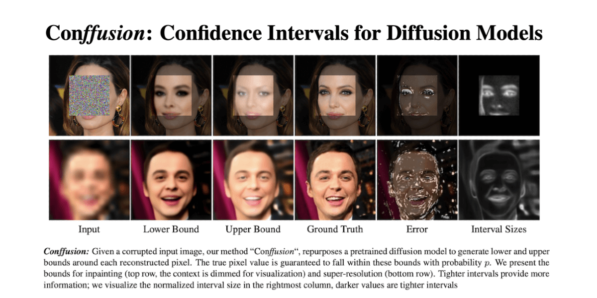

# Conffusion: Confidence Intervals for Diffusion Models
### [Project](https://www.vision.huji.ac.il/conffusion) | [Paper](https://arxiv.org/abs/)  
Official PyTorch Implementation for the "Conffusion: Confidence Intervals for Diffusion Models" paper.  

___

> **Conffusion: Confidence Intervals for Diffusion Models** 
> Eliahu Horwitz, Yedid Hoshen 
> https://arxiv.org/abs/  
>
>**Abstract:** Diffusion models have become the go-to method for many generative tasks, particularly for image-to-image generation tasks such as super-resolution and inpainting. 
> Current diffusion-based methods do not provide statistical guarantees regarding the generated results, often preventing their use in high-stakes situations. 
> To bridge this gap, we construct a confidence interval around each generated pixel such that the true value of the pixel is guaranteed to fall within the interval with a probability set by the user. 
> Since diffusion models parametrize the data distribution, a straightforward way of constructing such intervals is by drawing multiple samples and calculating their bounds. 
> However, this method has several drawbacks: i) slow sampling speeds ii) suboptimal bounds iii) requires training a diffusion model per task. 
> To mitigate these shortcomings we propose Conffusion, wherein we fine-tune a pre-trained diffusion model to predict interval bounds in a single forward pass. 
> We show that Conffusion outperforms the baseline method while being three orders of magnitude faster.

## Code Coming Soon...
