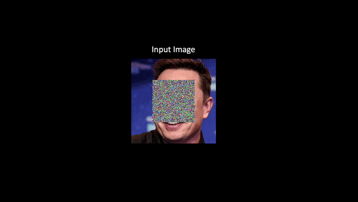

# Con*ffusion*: Confidence Intervals for Diffusion Models
### <a href="https://www.vision.huji.ac.il/conffusion" target="_blank">Project</a> | <a href="http://arxiv.org/abs/2211.09795" target="_blank">Paper</a> <br>
Official PyTorch Implementation for the "Con*ffusion*: Confidence Intervals for Diffusion Models" paper.  



<strong>Con*ffusion*:</strong> Given a corrupted input image, our method Con*ffusion*, repurposes a pretrained diffusion model to generate lower and upper bounds around each reconstructed pixel. The true pixel value is guaranteed to fall within these bounds with probability p. We present the bounds for inpainting (the context is dimmed for visualization) and super-resolution. Tighter intervals provide more information; we visualize the normalized interval size, darker values are tighter intervals
___

> **Con*ffusion*: Confidence Intervals for Diffusion Models**<br>
> Eliahu Horwitz, Yedid Hoshen<br>
> <a href="http://arxiv.org/abs/2211.09795" target="_blank">http://arxiv.org/abs/2211.09795 </a> <br>
>
>**Abstract:** Diffusion models have become the go-to method for many generative tasks, particularly for image-to-image generation tasks such as super-resolution and inpainting. 
> Current diffusion-based methods do not provide statistical guarantees regarding the generated results, often preventing their use in high-stakes situations. 
> To bridge this gap, we construct a confidence interval around each generated pixel such that the true value of the pixel is guaranteed to fall within the interval with a probability set by the user. 
> Since diffusion models parametrize the data distribution, a straightforward way of constructing such intervals is by drawing multiple samples and calculating their bounds. 
> However, this method has several drawbacks: i) slow sampling speeds ii) suboptimal bounds iii) requires training a diffusion model per task. 
> To mitigate these shortcomings we propose Con*ffusion*, wherein we fine-tune a pre-trained diffusion model to predict interval bounds in a single forward pass. 
> We show that Con*ffusion* outperforms the baseline method while being three orders of magnitude faster.


## Getting Started

### Setup 
1.  Clone the repo:
```bash
git clone https://github.com/eliahuhorwitz/Conffusion.git
cd Conffusion
```
2. Create a new environment and install the libraries:
```bash
python3 -m venv conffusion_venv
source conffusion_venv/bin/activate
pip install -r requirements.txt
```

3. Download the data from the <a href="https://drive.google.com/file/d/10nP41Z-cHmLuHrIOhvxe-IZrP-gnK4vm/view?usp=share_link" target="_blank">here</a> and extract it into a dir named `datasets` 

4. Run the desired model by following the links below:

### N-Con*ffusion*

- Super-resolution: [super_resolution_n_conffusion]()
- Inpainting: [inpainting_n_conffusion]()

### G-Con*ffusion*
- Super-resolution + Inpainting: [g_conffusion]()


## Citation
If you find this useful for your research, please use the following.

```
@article{horwitz2022conffusion,
  title={Conffusion: Confidence Intervals for Diffusion Models},
  author={Horwitz, Eliahu and Hoshen, Yedid},
  journal={arXiv preprint arXiv:2211.09795},
  year={2022}
}
```


## Acknowledgments


<a href="https://drive.google.com/file/d/10nP41Z-cHmLuHrIOhvxe-IZrP-gnK4vm/view?usp=share_link" target="_blank">here</a>


- The SR3 implementation is based on <a href="https://github.com/Janspiry/Image-Super-Resolution-via-Iterative-Refinement" target="_blank">this</a> unofficial implementation of SR3. 
- The Palette implementation is based on <a href="https://github.com/Janspiry/Palette-Image-to-Image-Diffusion-Models" target="_blank">this</a> unofficial implementation of Palette.
- The Guided-diffusion implementation is based on <a href="https://github.com/openai/guided-diffusion" target="_blank">this</a> official implementation.
- The implementation of the calibration and evaluation metrics is based on <a href="https://github.com/aangelopoulos/im2im-uq" target="_blank">this</a> official implementation of im2im-uq.