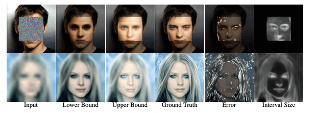

# Con*ffusion*: Confidence Intervals for Diffusion Models - G-Con*ffusion*
### <a href="https://www.vision.huji.ac.il/conffusion" target="_blank">Project</a> | <a href="http://arxiv.org/abs/2211.09795" target="_blank">Paper</a> <br>
Official PyTorch Implementation for the "Con*ffusion*: Confidence Intervals for Diffusion Models" paper.  




___

First, download the pretrained model from <a href="https://openaipublic.blob.core.windows.net/diffusion/jul-2021/128x128_diffusion.pt" target="_blank">here</a> into a dir named `models`
**Note:** You may need to add the guided-diffusion dir to the PYTHONPATH env var.

## Super-resolution G-Con*ffusion*

For training G-Con*ffusion* on the task of super-resolution, run:

```
mpiexec -n 1 python3 scripts/finetune_sr.py --attention_resolutions 32,16,8 --class_cond True --diffusion_steps 1000 \
--image_size 128 --learn_sigma True --noise_schedule linear --num_channels 256 --num_heads 4 --num_res_blocks 2 \
--resblock_updown True --use_fp16 True --use_scale_shift_norm True --model_path models/128x128_diffusion.pt \
--batch_size 4 --num_samples 1 --timestep_respacing 250 --prediction_time_step 3
```


Once the finetuning is complete, we can test the finetuned bounds. For this, we use the `model_path` and `options_path`
arguments with the actual experiment name of the finetuned run (i.e. have it point to the dir with the saved checkpoints).

An example command is 
```
mpiexec -n 1 python3 scripts/test_finetuned_sr.py --attention_resolutions 32,16,8 --class_cond True --diffusion_steps 1000 \
--image_size 128 --learn_sigma True --noise_schedule linear --num_channels 256 --num_heads 4 --num_res_blocks 2 \
--resblock_updown True --use_fp16 True --use_scale_shift_norm True --model_path experiments/<EXPERIMENT_NAME>/best_network.pt \
 --options_path experiments/<EXPERIMENT_NAME>/best_options.pt --batch_size 4 --num_samples 1 --timestep_respacing 250 --prediction_time_step 3
```


## Inpainting G-Con*ffusion*

For training G-Con*ffusion* on the task of inpainting, run:

```
mpiexec -n 1 python3 scripts/finetune_inpainting.py --attention_resolutions 32,16,8 --class_cond True \
 --diffusion_steps 1000 --image_size 128 --learn_sigma True --noise_schedule linear --num_channels 256 --num_heads 4 \
 --num_res_blocks 2 --resblock_updown True --use_fp16 True --use_scale_shift_norm True --model_path models/128x128_diffusion.pt \
 --batch_size 4 --num_samples 1 --timestep_respacing 250 --prediction_time_step 15
```


Once the finetuning is complete, we can test the finetuned bounds. For this, we use the `model_path` and `options_path`
arguments with the actual experiment name of the finetuned run (i.e. have it point to the dir with the saved checkpoints).

An example command is 
```
mpiexec -n 1 python3 scripts/test_finetuned_inpainting.py --attention_resolutions 32,16,8 --class_cond True --diffusion_steps 1000 \
--image_size 128 --learn_sigma True --noise_schedule linear --num_channels 256 --num_heads 4 --num_res_blocks 2 \
--resblock_updown True --use_fp16 True --use_scale_shift_norm True --model_path experiments/<EXPERIMENT_NAME>/best_network.pt \
 --options_path experiments/<EXPERIMENT_NAME>/best_options.pt --batch_size 4 --num_samples 1 --timestep_respacing 250 --prediction_time_step 15
```

___


For additional models and options, refer to the original Guided Diffusion repo found <a href="https://github.com/openai/guided-diffusion" target="_blank">here</a>. 
Keep in mind, not all the options are supported by Con*ffusion*. 

**Note:** This project assumes you are using wandb for logging.

## Citation
If you find this useful for your research, please use the following.

```
@article{horwitz2022conffusion,
  title={Conffusion: Confidence Intervals for Diffusion Models},
  author={Horwitz, Eliahu and Hoshen, Yedid},
  journal={arXiv preprint arXiv:2211.09795},
  year={2022}
}
```

## Acknowledgments
- The Guided Diffusion implementation is based on <a href="https://github.com/openai/guided-diffusion" target="_blank">this</a> official implementation of Guided Diffusion. 
- The implementation of the calibration and evaluation metrics is based on <a href="https://github.com/aangelopoulos/im2im-uq" target="_blank">this</a> official implementation of im2im-uq.
