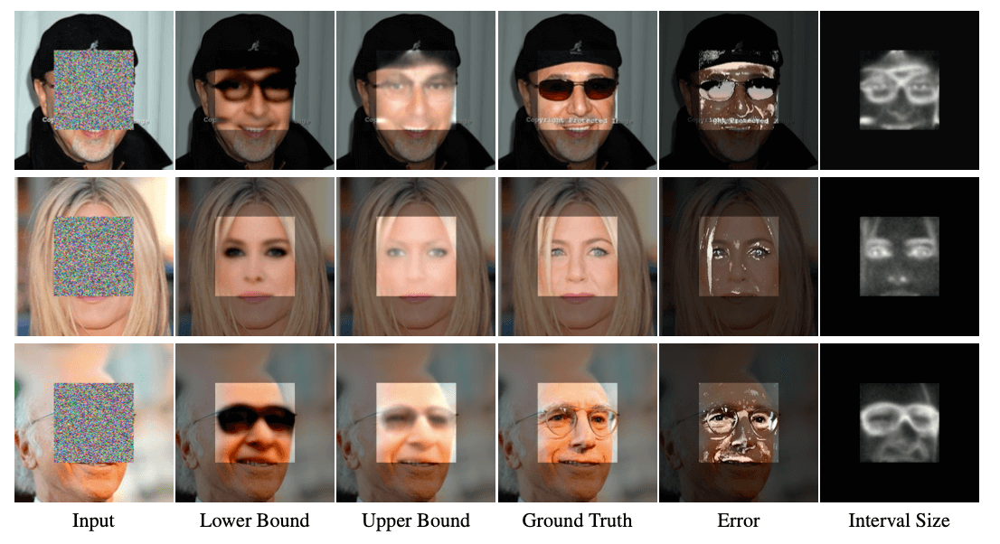

# Con*ffusion*: Confidence Intervals for Diffusion Models - Inpainting
### <a href="https://www.vision.huji.ac.il/conffusion" target="_blank">Project</a> | <a href="http://arxiv.org/abs/2211.09795" target="_blank">Paper</a> <br>
Official PyTorch Implementation for the "Con*ffusion*: Confidence Intervals for Diffusion Models" paper.  




___

First, download the pretrained model from <a href="https://drive.google.com/drive/folders/13YZ2UAmGJ-b7DICr-FDAPM7gctreJEoH?usp=sharing"  target="_blank">Google Drive</a> into a dir named `checkpoints/celeba_hq`

## N-Con*ffusion*

For training N-Con*ffusion* on the task of inpainting, run:

```
python3 inpainting_finetune_bounds.py -p calibration -c config/finetune_bounds_inpainting_center_nconffusion.json --enable_wandb
```


Once the finetuning is complete, we can test the finetuned bounds. For this, replace the value of `EXPERIMENT_NAME` 
of the `bounds_resume_state` argument in the file `test_finetune_bounds_inpainting_center_nconffusion.json` 
with the actual experiment name of the finetuned run (i.e. have it point to the dir with the saved checkpoints).

Finally, run the following command 
```
python3 test_finetuned_bounds.py --enable_wandb -c config/test_finetune_bounds_inpainting_center_nconffusion.json
```

___

## DM<sub>SB</sub>
First, we need to extract multiple reconstructed variations of each image corrupted. For this we need to run the `extract_bounds.py` script for each data split.  

**Note:** The `extract_bounds.py` assumes distributed extraction, hence the argument `distributed_worker_id` should be passed, dictates the current sample to extract the bounds for.

An example extraction for the first sample of the calibration set is:

```
python3 extract_bounds.py -p calibration -c config/extract_bounds_inpainting_center_conffusion.json --distributed_worker_id 0
```

Scripts for extracting the bounds using a slurm cluster are available under the `slurm_scripts` dir.

Once the bounds are extracted, we now perform the calibration step. For this, we run 

```
python3 test_sampled_bounds.py --enable_wandb
```

___

## DM<sub>SBA</sub>

Once we have the extracted bounds, we can finetune the diffusion model for a single-step prediction of the bounds. 
For this we run:

```
python3 inpainting_finetune_bounds.py -p calibration -c config/finetune_bounds_inpainting_center_dm_sba.json --enable_wandb --finetune_loss l2
```


Once the finetuning is complete, we can test the finetuned bounds. For this, replace the value of `EXPERIMENT_NAME` 
of the `bounds_resume_state` argument in the file `test_finetune_bounds_inpainting_center_dm_sba.json` 
with the actual experiment name of the finetuned run (i.e. have it point to the dir with the saved checkpoints).

Finally, run the following command 
```
python3 test_finetuned_bounds.py --enable_wandb  -c config/test_finetune_bounds_inpainting_center_dm_sba.json --finetune_loss l2
```

___


For additional models and options, refer to the original Palette repo found <a href="https://github.com/Janspiry/Palette-Image-to-Image-Diffusion-Models" target="_blank">here</a>. 
Keep in mind, not all the options are supported by Con*ffusion*. 

**Note:** This project assumes you are using wandb for logging.

## Citation
If you find this useful for your research, please use the following.

```
@article{horwitz2022conffusion,
  title={Conffusion: Confidence Intervals for Diffusion Models},
  author={Horwitz, Eliahu and Hoshen, Yedid},
  journal={arXiv preprint arXiv:2211.09795},
  year={2022}
}
```


## Acknowledgments
- The Palette implementation is based on <a href="https://github.com/Janspiry/Palette-Image-to-Image-Diffusion-Models" target="_blank">this</a> unofficial implementation of Palette. 
- The implementation of the calibration and evaluation metrics is based on <a href="https://github.com/aangelopoulos/im2im-uq" target="_blank">this</a> official implementation of im2im-uq.

