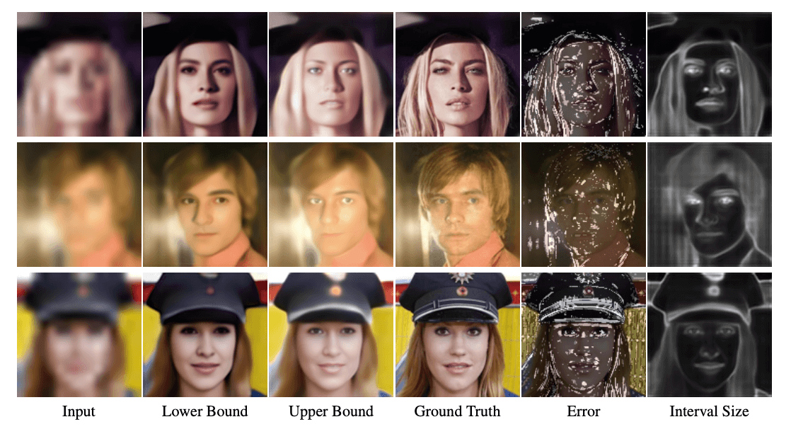

# Con*ffusion*: Confidence Intervals for Diffusion Models - SR3
### <a href="https://www.vision.huji.ac.il/conffusion" target="_blank">Project</a> | <a href="http://arxiv.org/abs/2211.09795" target="_blank">Paper</a> <br>
Official PyTorch Implementation for the "Con*ffusion*: Confidence Intervals for Diffusion Models" paper.  




___

First, download the pretrained model from <a href="https://drive.google.com/drive/folders/12jh0K8XoM1FqpeByXvugHHAF3oAZ8KRu?usp=sharing" target="_blank">Google Drive</a> | <a href="https://pan.baidu.com/s/1OzsGZA2Vmq1ZL_VydTbVTQ" target="_blank">Baidu Yun</a> into a dir named `checkpoints`


## N-Con*ffusion*

For training N-Con*ffusion* on the task of super-resolution, run:

```
python3 sr_finetune_bounds.py -p calibration -c config/finetune_bounds_16_128_conffusion.json --enable_wandb --finetune_loss quantile_regression
```


Once the finetuning is complete, we can test the finetuned bounds. For this, replace the value of `EXPERIMENT_NAME` 
of the `bounds_resume_state` argument in the file `test_finetune_bounds_16_128_conffusion.json` 
with the actual experiment name of the finetuned run (i.e. have it point to the dir with the saved checkpoints).

Finally, run the following command 
```
python3 test_finetuned_bounds.py --enable_wandb
```


___

## DM<sub>SB</sub>
First, we need to extract multiple reconstructed variations of each image corrupted. For this we need to run the `extract_bounds.py` script for each data split.  

**Note:** The `extract_bounds.py` assumes distributed extraction, hence the argument `distributed_worker_id` should be passed, dictates the current sample to extract the bounds for.

An example extraction for the first sample of the calibration set is:

```
python3 extract_bounds.py -p calibration -c config/extract_bounds_16_128_conffusion.json --distributed_worker_id 0
```

Scripts for extracting the bounds using a slurm cluster are available under the `slurm_scripts` dir.

Once the bounds are extracted, we now perform the calibration step. For this, we run 

```
python3 test_sampled_bounds.py --enable_wandb
```

___

## DM<sub>SBA</sub>

Once we have the extracted bounds, we can finetune the diffusion model for a single-step prediction of the bounds. 
For this we run:

```
python3 sr_finetune_bounds.py -p calibration -c config/finetune_bounds_16_128_conffusion.json --enable_wandb --finetune_loss l2
```


Once the finetuning is complete, we can test the finetuned bounds. For this, replace the value of `EXPERIMENT_NAME` 
of the `bounds_resume_state` argument in the file `test_finetune_bounds_16_128_conffusion.json` 
with the actual experiment name of the finetuned run (i.e. have it point to the dir with the saved checkpoints).

Finally, run the following command 
```
python3 test_finetuned_bounds.py --enable_wandb
```

___


For additional models and options, refer to the original SR3 repo found <a href="https://github.com/Janspiry/Image-Super-Resolution-via-Iterative-Refinement" target="_blank">here</a>. 
Keep in mind, not all the options are supported by Con*ffusion*. 

**Note:** This project assumes you are using wandb for logging.


## Acknowledgments
- The SR3 implementation is based on <a href="https://github.com/Janspiry/Image-Super-Resolution-via-Iterative-Refinement" target="_blank">this</a> unofficial implementation of SR3. 
